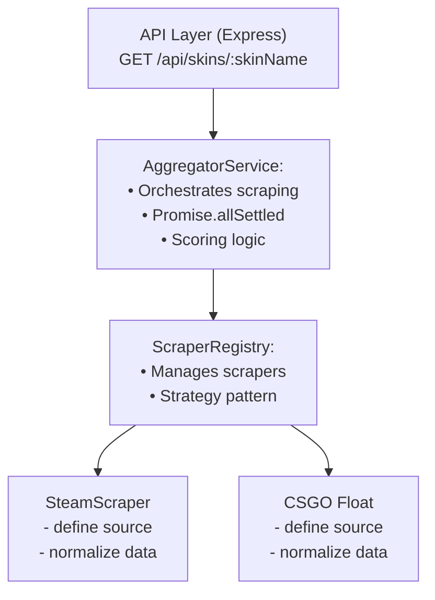

# Skin Price Aggregator

Aggregator for CS GO skin prices from multiple marketplaces.

## Installation

1. **Clone the repository and install dependencies:**
   ```bash
   git clone <repository-url>
   cd skinscanner
   npm install
   ```

2. **Set up environment variables:**
   - Copy the example environment file:
     ```bash
     cp .env.example .env
     ```
   - Edit `.env` and add your API keys:
     ```
     PORT=7777
     ```

## Usage

1. **Start the development server:**
   ```bash
   npm run dev
   ```

2. **Access the API:**
   The server will start on `http://localhost:7777` (or the PORT specified in your .env file).

   **Get skin prices:**
   ```
   GET http://localhost:7777/api/skins/AK-47?with_variant=1
   ```

   **Health check:**
   ```
   GET http://localhost:7777/health
   ```

## Marketplaces

- **CSFloat**: (I think..) Requires API key for authenticated access
- **Steam Community Market**: Public API (no authentication required)

## API Endpoints

- `GET /health` - Health check endpoint
- `GET /api/skins/:name` - Get aggregated prices for a skin
  - Query parameters:
    - `with_variant=1` - Include skin variants in results


## High Level Architecture


